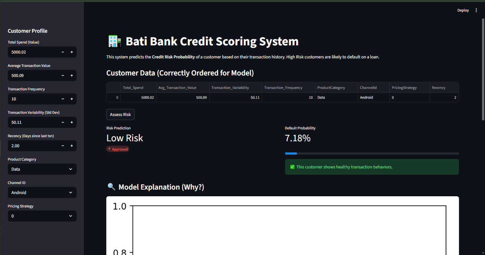

# 🏦 Bati Bank – Credit Risk Scoring Model


A **production-grade credit scoring system** that uses customer transaction behavior to predict default risk.  
This project demonstrates a **full end-to-end machine learning pipeline**—from data processing and model training to deployment as an interactive dashboard with model explainability.

---

## 🚀 Interactive Demo



*A screenshot of the Streamlit dashboard.*

---

## 💼 Business Problem & Compliance

Bati Bank is partnering with an e-commerce platform to offer a **Buy Now, Pay Later (BNPL)** service.  
To minimize financial losses from loan defaults, the bank requires a reliable way to assess the **credit risk of customers with no traditional credit history**.

### 🏛️ Basel II Compliance

This project aligns with the **Basel II Internal Ratings-Based (IRB) approach** by:

- **Risk Quantification:** The model predicts a **Probability of Default (PD)**.
- **Transparency & Auditability:** Model decisions are explainable using **SHAP**, meeting regulatory expectations.

### 📊 Proxy Target Strategy (RFM Analysis)

Because historical default labels are unavailable, the project creates a **proxy target variable** using **RFM analysis**:

- **Recency** – How recently a customer transacted  
- **Frequency** – How often they transact  
- **Monetary Value** – How much they spend  

Customers with **high recency, low frequency, and low monetary value** are assumed to be higher risk.  
These segments are identified using **K-Means clustering** and labeled as **high-risk**.

---

## 💡 Solution Overview & Key Features

This solution delivers a robust, production-ready ML system with:

- **✅ Reliability**  
  Automated unit tests (`pytest`) and CI/CD via **GitHub Actions** ensure code quality and stability.

- **🔍 Explainability**  
  **SHAP** provides feature-level explanations for every prediction, clearly showing *why* a customer is classified as high or low risk.

- **🎈 User-Friendly Interface**  
  A **Streamlit dashboard** enables loan officers to generate instant risk scores and explanations—no coding required.

- **🧱 Modular Codebase**  
  Clean, modular project structure following professional software engineering best practices.

---

## 📁 Project Structure

```text
credit-risk-model/
├── .github/workflows/ci.yml   # 🚀 CI/CD Pipeline
├── data/                      # 💾 Raw and processed data
├── models/artifacts/          # 📦 Trained model, preprocessor, feature list
├── notebooks/                 # 📓 EDA and experimentation
├── src/                       # 🛠️ Production source code
│   ├── api/                   # (Optional) FastAPI implementation
│   ├── features.py            # Feature engineering logic
│   ├── train.py               # Model training script
│   └── utils.py               # Helper functions
├── tests/                     # 🧪 Unit tests
├── dashboard.py               # 🎈 Streamlit application
└── requirements.txt           # 📦 Project dependencies

## ⚙️ Quick Start

### Prerequisites

- Python **3.9+**
- Git

---

### 1️⃣ Clone the Repository

```bash
git clone https://github.com/eyuBirhanu/credit-risk-model.git
cd credit-risk-model
```

### 2️⃣ Install Dependencies

```bash
pip install -r requirements.txt
```

### 3️⃣ Run the Dashboard

```bash
streamlit run dashboard.py
```

The application will be available at: 👉 **[http://localhost:8501](http://localhost:8501)**

### 4️⃣ Run Tests (Optional) To verify data processing and model logic: bash Copy code `pytest`